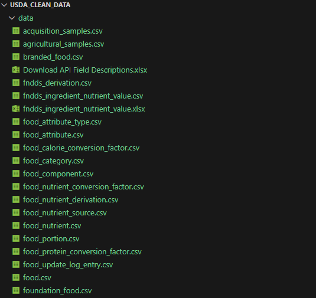

# usda_clean_data
Making a usable dataset out of USDA. 

USDA contains pretty nice dataset, but sometimes is not straightforward to deal with their dataset. Plus, it contains some irregularities. 

Through this process, it is assumed that all the data is stored under the folder /data

For this code the used dataset is the one of "all data types". 

Documentation of USDA Foundation Foods:
https://fdc.nal.usda.gov/Foundation_Foods_Documentation

Link to download datasets:
https://fdc.nal.usda.gov/download-datasets

FOUNDATION FOODS:
https://fdc.nal.usda.gov/fdc-datasets/FoodData_Central_foundation_food_csv_2024-10-31.zip

SR LEGACY:
https://fdc.nal.usda.gov/fdc-datasets/FoodData_Central_sr_legacy_food_csv_2018-04.zip

FOOD AND NUTRIENT DATABASE FOR DIETARY STUDIES:
https://fdc.nal.usda.gov/fdc-datasets/FoodData_Central_survey_food_csv_2024-10-31.zip

BRANDED FOODS:
https://fdc.nal.usda.gov/fdc-datasets/FoodData_Central_branded_food_csv_2024-10-31.zip

ALL DATA TYPES:
https://fdc.nal.usda.gov/fdc-datasets/FoodData_Central_csv_2024-10-31.zip

